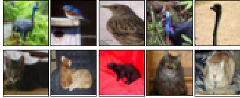
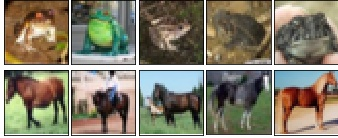
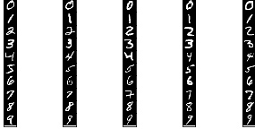
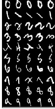
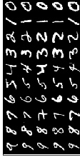
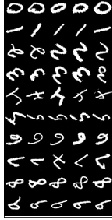
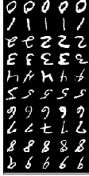

<div align="center">

# Continuum: Simple Management of Complex Continual Learning Scenarios

[](https://badge.fury.io/py/continuum) [](https://travis-ci.com/Continvvm/continuum) [](https://www.codacy.com/gh/Continvvm/continuum?utm_source=github.com&amp;utm_medium=referral&amp;utm_content=Continvvm/continuum&amp;utm_campaign=Badge_Grade) [](https://zenodo.org/badge/latestdoi/254864913) [](https://continuum.readthedocs.io/en/latest/?badge=latest)
[]()

[](https://continuum.readthedocs.io/)
[](https://arxiv.org/abs/2102.06253)
[](https://www.youtube.com/watch?v=ntSR5oYKyhM)
</div>

## A library for PyTorch's loading of datasets in the field of Continual Learning

Aka Continual Learning, Lifelong-Learning, Incremental Learning, etc.

Read the [documentation](https://continuum.readthedocs.io/en/latest/). <br>
Test Continuum on [Colab](https://colab.research.google.com/drive/1bRx3M1YFcol9RZxBZ51brxqGWrf4-Bzn?usp=sharing) !

### Example:

Install from and PyPi:
```bash
pip3 install continuum
```

And run!
```python
from torch.utils.data import DataLoader

from continuum import ClassIncremental
from continuum.datasets import MNIST
from continuum.tasks import split_train_val

dataset = MNIST("my/data/path", download=True, train=True)
scenario = ClassIncremental(
    dataset,
    increment=1,
    initial_increment=5
)

print(f"Number of classes: {scenario.nb_classes}.")
print(f"Number of tasks: {scenario.nb_tasks}.")

for task_id, train_taskset in enumerate(scenario):
    train_taskset, val_taskset = split_train_val(train_taskset, val_split=0.1)
    train_loader = DataLoader(train_taskset, batch_size=32, shuffle=True)
    val_loader = DataLoader(val_taskset, batch_size=32, shuffle=True)

    for x, y, t in train_loader:
        # Do your cool stuff here
```

### Supported Types of Scenarios

|Name | Acronym | Supported | Scenario |
|:----|:---|:---:|:---:|
| **New Instances** | NI | :white_check_mark: | [Instances Incremental](https://continuum.readthedocs.io/en/latest/_tutorials/scenarios/scenarios.html#instance-incremental)|
| **New Classes** | NC | :white_check_mark: |[Classes Incremental](https://continuum.readthedocs.io/en/latest/_tutorials/scenarios/scenarios.html#classes-incremental)|
| **New Instances & Classes** | NIC | :white_check_mark: | [Data Incremental](https://continuum.readthedocs.io/en/latest/_tutorials/scenarios/scenarios.html#new-class-and-instance-incremental)|

### Supported Datasets:

Most dataset from [torchvision.dasasets](https://pytorch.org/docs/stable/torchvision/datasets.html) are supported, for the complete list, look at the documentation page on datasets [here](https://continuum.readthedocs.io/en/latest/_tutorials/datasets/dataset.html).

Furthermore some "Meta"-datasets are can be create or used from numpy array or any torchvision.datasets or from a folder for datasets having a tree-like structure or by combining several dataset and creating dataset fellowships!

### Indexing

All our continual loader are iterable (i.e. you can for loop on them), and are
also indexable.

Meaning that `clloader[2]` returns the third task (index starts at 0). Likewise,
if you want to evaluate after each task, on all seen tasks do `clloader_test[:n]`.

### Example of Sample Images from a Continuum scenario

**CIFAR10**:

||||||
|:-------------------------:|:-------------------------:|:-------------------------:|:-------------------------:|:-------------------------:|
|Task 0 | Task 1 | Task 2 | Task 3 | Task 4|

**MNIST Fellowship (MNIST + FashionMNIST + KMNIST)**:

||||
|:-------------------------:|:-------------------------:|:-------------------------:|
|Task 0 | Task 1 | Task 2 |


**PermutedMNIST**:

||||||
|:-------------------------:|:-------------------------:|:-------------------------:|:-------------------------:|:-------------------------:|
|Task 0 | Task 1 | Task 2 | Task 3 | Task 4|

**RotatedMNIST**:

||||||
|:-------------------------:|:-------------------------:|:-------------------------:|:-------------------------:|:-------------------------:|
|Task 0 | Task 1 | Task 2 | Task 3 | Task 4|

### Citation

If you find this library useful in your work, please consider citing it:

```
@misc{douillardlesort2021continuum,
  author={Douillard, Arthur and Lesort, Timothée},
  title={Continuum: Simple Management of Complex Continual Learning Scenarios},
  publisher={arXiv: 2102.06253},
  year={2021}
}
```


### Maintainers

This project was started by a joint effort from [Arthur Douillard](https://arthurdouillard.com/) &
[Timothée Lesort](https://tlesort.github.io/), and we are currently the two maintainers.

Feel free to contribute! If you want to propose new features, please create an issue.

Contributors: [prlz77](https://github.com/prlz77), [yantonov](https://github.com/yantonov),
[psychicmario](https://github.com/psychicmario), [fcld94](https://github.com/fcdl94)


### On PyPi

Our project is available on PyPi!

```bash
pip3 install continuum
```

Note that previously another project, a CI tool, was using that name. It is now
there [continuum_ci](https://pypi.org/project/continuum_ci/).
