# Continual Loader (CLLoader)

[](https://badge.fury.io/py/clloader) [](https://travis-ci.com/arthurdouillard/continual_loader) [](https://www.codacy.com/gh/Continvvm/continuum?utm_source=github.com&amp;utm_medium=referral&amp;utm_content=Continvvm/continuum&amp;utm_campaign=Badge_Grade) [](https://zenodo.org/badge/latestdoi/254864913) [](https://continuum.readthedocs.io/en/latest/?badge=latest)

## A library for PyTorch's loading of datasets in the field of Continual Learning

Aka Continual Learning, Lifelong-Learning, Incremental Learning, etc.


### Example:

Install from and PyPi:
```bash
pip3 install continuum
```

And run!
```python
from torch.utils.data import DataLoader

from continuum import ClassIncremental
from continuum.datasets import MNIST

clloader = ClassIncremental(
    MNIST("my/data/path", download=True),
    increment=1,
    initial_increment=5,
    train=True  # a different loader for test
)

print(f"Number of classes: {clloader.nb_classes}.")
print(f"Number of tasks: {clloader.nb_tasks}.")

for task_id, train_dataset in enumerate(clloader):
    train_dataset, val_dataset = split_train_val(train_dataset)
    train_loader = DataLoader(train_dataset)
    val_loader = DataLoader(val_dataset)

    # Do your cool stuff here
```

### Supported Scenarios

|Name | Acronym | Supported |
|:----|:---|:---:|
| **New Instances** | NI | :white_check_mark: |
| **New Classes** | NC | :white_check_mark: |
| **New Instances & Classes** | NIC | :x: |

### Supported Datasets:

Note that the task sizes are fully customizable.

|Name | Nb classes | Image Size | Automatic Download |
|:----|:---:|:----:|:---:|
| **MNIST** | 10 | 28x28x1 | :white_check_mark: |
| **Fashion MNIST** | 10 | 28x28x1 | :white_check_mark: |
| **KMNIST** | 10 | 28x28x1 | :white_check_mark: |
| **EMNIST** | 10 | 28x28x1 | :white_check_mark: |
| **QMNIST** | 10 | 28x28x1 | :white_check_mark: |
| **MNIST Fellowship** | 30 | 28x28x1 | :white_check_mark: |
| **CIFAR10** | 10 | 32x32x3 | :white_check_mark: |
| **CIFAR100** | 100 | 32x32x3 | :white_check_mark: |
| **CIFAR Fellowship** | 110 | 32x32x3 | :white_check_mark: |
| **ImageNet100** | 100 | 224x224x3 | :x: |
| **ImageNet1000** | 1000 | 224x224x3 | :x: |
| **Permuted MNIST** | 10 | 28x28x1 | :white_check_mark: |
| **Rotated MNIST** | 10 | 28x28x1 | :white_check_mark: |

Furthermore some "Meta"-datasets are available:

**InMemoryDataset**, for in-memory numpy array:
```python
x_train, y_train = gen_numpy_array()
x_test, y_test = gen_numpy_array()

clloader = CLLoader(
    InMemoryDataset(x_train, y_train, x_test, y_test),
    increment=10,
)
```

**PyTorchDataset**,for any dataset defined in torchvision:
```python
clloader = CLLoader(
    PyTorchDataset("/my/data/path", dataset_type=torchvision.datasets.CIFAR10),
    increment=10,
)
```

**ImageFolderDataset**, for datasets having a tree-like structure, with one folder per class:
```python
clloader = CLLoader(
    ImageFolderDataset("/my/train/folder", "/my/test/folder"),
    increment=10,
)
```

**Fellowship**, to combine several continual datasets.:
```python
clloader = CLLoader(
    Fellowship("/my/data/path", dataset_list=[CIFAR10, CIFAR100]),
    increment=10,
)
```

Some datasets cannot provide an automatic download of the data for miscealleneous reasons. For example for ImageNet, you'll need to download the data from the [official page](http://www.image-net.org/challenges/LSVRC/2012/downloads). Then load it likewise:
```python
clloader = CLLoader(
    ImageNet1000("/my/train/folder", "/my/test/folder"),
    increment=10,
)
```

Some papers use a subset, called ImageNet100 or ImageNetSubset. You'll need to get the subset ids. It's either a file in the following format:
```
my/path/to/image0.JPEG target0
my/path/to/image1.JPEG target1
```
Or a list of tuple `[("my/path/to/image0.JPEG", target0), ...]`. Then loading the continual loader is very simple:
```python
clloader = CLLoader(
    ImageNet100(
        "/my/train/folder",
        "/my/test/folder",
        train_subset=... # My subset ids
        test_subset=... # My subset ids
    ),
    increment=10,
)
```

### Continual Loader

The Continual Loader `CLLoader` loads the data and batch it in several tasks. See there some example arguments:

```python
clloader = CLLoader(
    my_continual_dataset,
    increment=10,
    initial_increment=2,
    train_transformations=[transforms.RandomHorizontalFlip()],
    common_transformations=[
        transforms.ToTensor(),
        transforms.Normalize((0.4914, 0.4822, 0.4465), (0.2023, 0.1994, 0.2010))
    ],
    evaluate_on="seen"
)
```

Here the first task is made of 2 classes, then all following tasks of 10 classes. You can have a more finegrained increment by providing a list of `increment=[2, 10, 5, 10]`.

The `train_transformations` is applied only on the training data, while the `common_transformations` on both the training and testing data.

By default, we evaluate our model after each task on `seen` classes. But you can evalute only on `current` classes, or even on `all` classes.


### Sample Images

**MNIST**:

|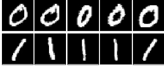|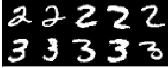|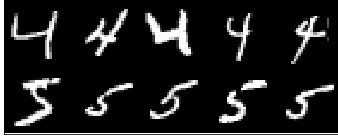|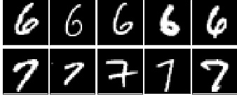|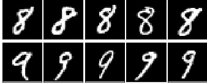|
|:-------------------------:|:-------------------------:|:-------------------------:|:-------------------------:|:-------------------------:|
|Task 0 | Task 1 | Task 2 | Task 3 | Task 4|

**FashionMNIST**:

|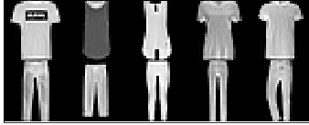|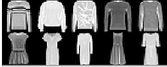|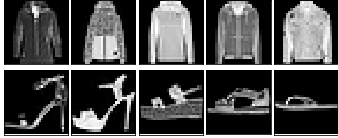|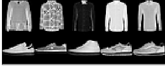|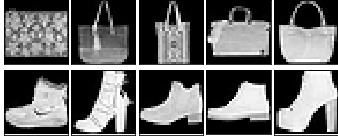|
|:-------------------------:|:-------------------------:|:-------------------------:|:-------------------------:|:-------------------------:|
|Task 0 | Task 1 | Task 2 | Task 3 | Task 4|

**CIFAR10**:

||||||
|:-------------------------:|:-------------------------:|:-------------------------:|:-------------------------:|:-------------------------:|
|Task 0 | Task 1 | Task 2 | Task 3 | Task 4|

**MNIST Fellowship (MNIST + FashionMNIST + KMNIST)**:

||||
|:-------------------------:|:-------------------------:|:-------------------------:|
|Task 0 | Task 1 | Task 2 |


**PermutedMNIST**:

||||||
|:-------------------------:|:-------------------------:|:-------------------------:|:-------------------------:|:-------------------------:|
|Task 0 | Task 1 | Task 2 | Task 3 | Task 4|

**RotatedMNIST**:

||||||
|:-------------------------:|:-------------------------:|:-------------------------:|:-------------------------:|:-------------------------:|
|Task 0 | Task 1 | Task 2 | Task 3 | Task 4|


**ImageNet100**:

|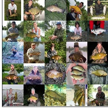|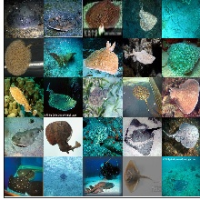|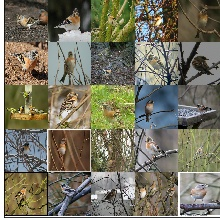|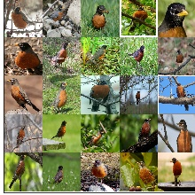| ... |
|:-------------------------:|:-------------------------:|:-------------------------:|:-------------------------:|:-------------------------:|
|Task 0 | Task 1 | Task 2 | Task 3 | ... |


### Citation

If you find this library useful in your work, please consider citing it:

```
@software{douillard_lesort_continuum20,
  author       = {Arthur Douillard, Timothée LESORT},
  title        = {Continuum library},
  month        = {April},
  year         = {2020},
  publisher    = {Zenodo},
  version      = {v1.0},
  doi          = {10.5281/zenodo.8475},
  url          = {https://doi.org/10.5281/zenodo.8475}
}
```

### On PyPi

Our project is available on PyPi!

```bash
pip3 install continuum
```

Note that previously another project, a CI tool, was using that name. It is now
there [continuum_ci](https://pypi.org/project/continuum_ci/).
