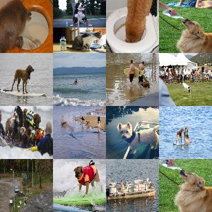
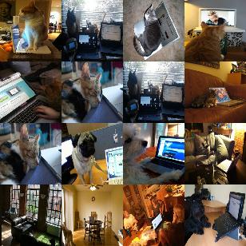

MetaShift
---------

MetaShift can be described as a dataset of dataset. It divides the original Visual Genome dataset into classes and contexts in order to capture distribution shifts.
See paper : https://arxiv.org/abs/2202.06523

In continuum, we use the context information to build various types of scenarios, notably domain incremental scenario.

The user can select a subset of classes to include in the scenario with :code:`class_names` argument and if all class should appear in all tasks with :code:`strict_domain_inc` argument.

Images can be associated with several context, then the user can decide if one image appear only once or can appear several time.
If the image should appear only once, then the context chosen will be selected randomly.

Visual Genome:
##############

To download the Visual Genome dataset in advance :

.. code-block:: bash

    wget -c https://nlp.stanford.edu/data/gqa/images.zip
    unzip images.zip -d MetaShift

Use the :code:`visual_genome_path` argument in MetaShift constructor if you already have the original Visual Genome dataset downloaded.
Provide it with the path to the folder containing all Visual Genome images.

.. code-block:: python

    from continuum.datasets import MetaShift
    data = MetaShift(datafolder, visual_genome_path = "some/path/images")

ContinualScenario:
##################

Beware that the default configuration will download the full Visual Genome dataset if it is not already present in a folder named "MetaShift" (20GB).

Tasks are defined by the context in whcich  the objects appear. In the following example, dogs and cats with water on the right and with computers on the left.

- Default scenario settings:

.. code-block:: python

    from continuum.datasets import MetaShift
    from continuum.scenarios import ContinualScenario

    data = MetaShift(datafolder)
    scenario = ContinualScenario(data)

- Specific classes:

Select specific classes to appear in the dataset with the argument :code:`class_names`.
Then specify if all classes should apprear in all tasks with the argument :code:`strict_domain_inc`. If True, only contexts found in all specified classes will be kept.

.. code-block:: python

    from continuum.datasets import MetaShift
    from continuum.scenarios import ContinualScenario
    from continuum.datasets.metashift import get_all_classes_contexts

    all_classes, all_contexts = get_all_classes_contexts(datafolder) 
    # Use this function to retrieve all metashift classes and contexts.

    data = MetaShift(datafolder, class_names = ["cat", "dog"], strict_domain_inc = True)
    scenario = ContinualScenario(data)

- Specific contexts:

Select specific contexts with the argument :code:`context_names`.

.. code-block:: python

    from continuum.datasets import MetaShift
    from continuum.scenarios import ContinualScenario
    from continuum.datasets.metashift import get_all_contexts_from_classes

    contexts = get_all_contexts_from_classes(datafolder, ["cat", "dog", "horse"]) 
    # Use this function to retreive all metashift contexts for given classes.

    data = MetaShift(datafolder, context_names=["water", "ocean"])
    scenario = ContinualScenario(data)

- Get a unique task for each image:

Tasks can appear in multiple combinations of classes and contexts.
By setting :code:`unique_occurence=True`, the task in which each image appears will be chosen randomly.

.. code-block:: python

    from continuum.datasets import MetaShift
    from continuum.scenarios import ContinualScenario

    data = MetaShift(datafolder, unique_occurence=True, random_seed=42)
    scenario = ContinualScenario(data)
